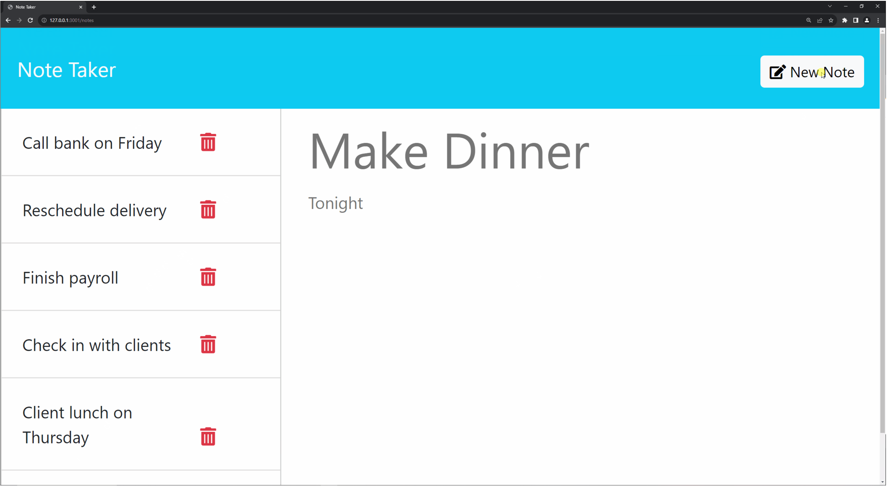

# note-taker

## Description
  We were tasked in our Bootcamp to create a note taking application using Express.js

## Usage
To use the skills we've learned in class to build a note taking app using only backend code

## Credits
W3Schools, MDN Web Docs, StackOverflow

## License
None

## Questions:
Feel free to reach out on Github for further questions: nmahban
